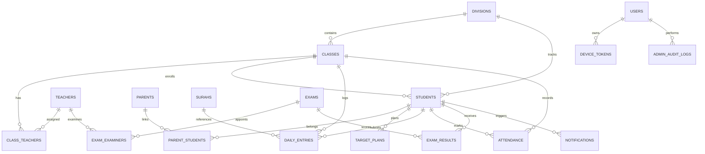

# Al Haqqaniyyah Arabic College — Hifz Section
# Admin Web Application Specification (`Hfz-Admin`)

> **Document Version:** 1.0.0  
> **Status:** Production Specification & Architectural Blueprint  
> **Target Stack:** Next.js 15+ (App Router, Server Components, Server Actions), TypeScript, Tailwind CSS v4, shadcn/ui, Supabase (PostgreSQL 15+, Supabase Auth, Edge Functions, Storage, Realtime).  
> **Companion Systems:**
> - Teacher Mobile App (`Hfz-Pro`): React Native / Expo (SDK 57, expo-router)
> - Parent Mobile App (`Hfz-Parent`): React Native / Expo ([`PARENT_APP_SPEC.md`](./PARENT_APP_SPEC.md))
> - Primary Data Store: Supabase PostgreSQL (`supabase/schema.sql`, `supabase/setup_schema.sql`, `supabase/seed.sql`)

---

## Table of Contents

1. [Executive Summary & Institutional Context](#1-executive-summary--institutional-context)
2. [Madrasa Domain Model & Pedagogical Business Rules](#2-madrasa-domain-model--pedagogical-business-rules)
   - [2.1 The Four Sequential Academic Divisions](#21-the-four-sequential-academic-divisions)
   - [2.2 The Student Memorization Journey & Backward Progression](#22-the-student-memorization-journey--backward-progression)
   - [2.3 The Daily Three-Lesson System (Sabaq → Sabq → Manzil)](#23-the-daily-three-lesson-system-sabaq--sabq--manzil)
   - [2.4 Pedagogical Gatekeeping: The Hold Rule & Nazira Pre-Read](#24-pedagogical-gatekeeping-the-hold-rule--nazira-pre-read)
   - [2.5 The 100-Mark Multi-Component Examination System](#25-the-100-mark-multi-component-examination-system)
   - [2.6 Dawr Revision Ladder & Girdan Zero-Mistake Standard](#26-dawr-revision-ladder--girdan-zero-mistake-standard)
3. [Enterprise Database Architecture (PostgreSQL / Supabase)](#3-enterprise-database-architecture-postgresql--supabase)
   - [3.1 Entity Relationship Diagram (ERD)](#31-entity-relationship-diagram-erd)
   - [3.2 Complete Schema & Data Dictionary](#32-complete-schema--data-dictionary)
   - [3.3 Triggers, Automated Views & Stored Procedures](#33-triggers-automated-views--stored-procedures)
4. [Security, Authentication & RBAC Migration](#4-security-authentication--rbac-migration)
   - [4.1 Auth Migration from Legacy Shared PIN to Supabase Auth](#41-auth-migration-from-legacy-shared-pin-to-supabase-auth)
   - [4.2 Role-Based Access Control (RBAC) Matrix](#42-role-based-access-control-rbac-matrix)
   - [4.3 Production Row Level Security (RLS) Policies](#43-production-row-level-security-rls-policies)
   - [4.4 Zero-Downtime Migration & Data Bridging Strategy](#44-zero-downtime-migration--data-bridging-strategy)
5. [Admin Web Application Architecture & Tech Stack](#5-admin-web-application-architecture--tech-stack)
   - [5.1 Full Technology Stack](#51-full-technology-stack)
   - [5.2 Project Directory Structure](#52-project-directory-structure)
   - [5.3 Design System & Theme Tokens](#53-design-system--theme-tokens)
   - [5.4 Internationalization (i18n) & Trilingual RTL Support](#54-internationalization-i18n--trilingual-rtl-support)
   - [5.5 Document Generation Engine (PDF & Excel)](#55-document-generation-engine-pdf--excel)
6. [Detailed Screen Specifications & Feature Modules](#6-detailed-screen-specifications--feature-modules)
   - [6.1 Module 1: Executive Dashboard & Live Command Center](#61-module-1-executive-dashboard--live-command-center)
   - [6.2 Module 2: Floors & Classes Management](#62-module-2-floors--classes-management)
   - [6.3 Module 3: Faculty & Teacher Directory](#63-module-3-faculty--teacher-directory)
   - [6.4 Module 4: Student Information System (SIS) & 360° Profiles](#64-module-4-student-information-system-sis--360-profiles)
   - [6.5 Module 5: Daily Academic Monitoring & Nazira Central](#65-module-5-daily-academic-monitoring--nazira-central)
   - [6.6 Module 6: Attendance Management & Leave Portal](#66-module-6-attendance-management--leave-portal)
   - [6.7 Module 7: Examination, Grading & Graduation Center](#67-module-7-examination-grading--graduation-center)
   - [6.8 Module 8: Specialized Dawr & Girdan Tracking Modules](#68-module-8-specialized-dawr--girdan-tracking-modules)
   - [6.9 Module 9: Parent & Guardian Database Linker](#69-module-9-parent--guardian-database-linker)
   - [6.10 Module 10: Announcements & Multi-Channel Broadcast Center](#610-module-10-announcements--multi-channel-broadcast-center)
   - [6.11 Module 11: System Administration, Audit Logs & Data Backup](#611-module-11-system-administration-audit-logs--data-backup)
7. [API Routes, Server Actions & Edge Functions Architecture](#7-api-routes-server-actions--edge-functions-architecture)
8. [UI/UX Component Hierarchy & Design Patterns](#8-uiux-component-hierarchy--design-patterns)
9. [Implementation Roadmap & Milestones](#9-implementation-roadmap--milestones)

---

## 1. Executive Summary & Institutional Context

**Al Haqqaniyyah Arabic College** (Kandy, Sri Lanka) operates one of the country's most renowned Hifz faculties, currently educating **336+ full-time Hifz students** across **32 active classes** situated over **7 residential and academic floors (Ground Floor to 6th Floor)**, instructed by **32 dedicated Asatizah (Ash-Sheikh faculty)**.

The educational ecosystem consists of three interconnected software applications operating on a single unified Supabase PostgreSQL backend:
1. **Teacher Mobile App (`Hfz-Pro`)**: React Native / Expo application used on mobile devices by classroom teachers for high-speed offline-first daily recitation entry, classroom attendance, and mobile exam score submission.
2. **Parent Mobile App (`Hfz-Parent`)**: Mobile application for fathers, mothers, and guardians to receive real-time push notifications of daily Sabaq progress, teacher remarks, attendance alerts, and published examination transcripts.
3. **Admin Web Application (`Hfz-Admin`)**: The desktop/web command center specified in this document. It empowers the **Principal (Muddir)**, **Head of Hifz (Nazir)**, **Floor Supervisors**, **Academic Coordinators**, **Chief Examiners**, and **Administrative Registrars** to monitor college-wide academic health, enforce strict pedagogical standards, manage faculty and students, organize complex 100-mark examination sessions, orchestrate Dawr and Girdan divisions, and maintain total institutional auditability.

```
┌─────────────────────────────────────────────────────────────────────────────┐
│                      AL HAQQANIYYAH HIFZ ECOSYSTEM                          │
├───────────────────────────────┬─────────────────────────────────────────────┤
│   Hfz-Pro (Teacher App)       │ Daily Sabaq/Sabqi/Manzil, Attendance,       │
│   [React Native / Expo SDK 57]│ Mobile Exam Entry, Offline Fallback         │
├───────────────────────────────┼─────────────────────────────────────────────┤
│   Hfz-Parent (Parent App)     │ Push Alerts, Child Progress, Report Cards,  │
│   [React Native / Expo]       │ Teacher Remarks, Multi-Child Switching      │
├───────────────────────────────┼─────────────────────────────────────────────┤
│   Hfz-Admin (Admin Web App)   │ Central SIS, Floor/Class Map, Hold Queue,   │
│   [Next.js 15+ / SSR / Actions│ 100-Mark Exam Center, Dawr/Girdan Modules,  │
│    TanStack Table / Radix UI] │ PDF Transcripts, Staff Auth, Audit Logs     │
└───────────────────────────────┴─────────────────────────────────────────────┘
                                       │
                                       ▼
┌─────────────────────────────────────────────────────────────────────────────┐
│                   SUPABASE POSTGRESQL & EDGE PLATFORM                       │
│  - 19 Tables with UUID PKs & Strict Foreign Key Cascades                    │
│  - Multi-Tenant Row Level Security (RLS) with Role Claims                   │
│  - Edge Functions (Push Notifications, PDF Reports, SMS Alerts)            │
│  - Automated Realtime Replication & Webhooks                                │
└─────────────────────────────────────────────────────────────────────────────┘
```

---

## 2. Madrasa Domain Model & Pedagogical Business Rules

The Hifz section of Al Haqqaniyyah Arabic College functions according to classical, highly disciplined South Asian and Middle Eastern Quran memorization methodologies with rigorous institutional safeguards. The Admin Web App must model and automate these rules faithfully.

### 2.1 The Four Sequential Academic Divisions

A student at Al Haqqaniyyah progresses through four distinct divisions:

| # | Division Code | Division Name (EN) | Division Name (AR) | Typical Duration | Primary Focus & Methodology |
|---|---|---|---|---|---|
| 1 | `hifz` | **Hifzul Quran** | حفظ القرآن | 3 Years (until 30 Juz) | Memorization of all 30 Juz running backwards from Juz 30 to Juz 1. Standard 15-line Madani Mushaf. |
| 2 | `girdan` | **Qirdhan (Girdan)** | قردان | 1 Year | Letter-by-letter Tajweed perfection & vocal articulation (Pakistan method, 3rd Floor). Zero-mistake rule. |
| 3 | `riwayath` | **Riwayath** | روايات | 2 Years (Selective) | Advanced study of the Ten Qira'at (الشاطبية / الدرة) for top Girdan graduates (Year-End Score ≥ 90). Leads to title of **Qari**. |
| 4 | `dawr` | **Dawr** | دور | Staged / Rotational | Multi-speed rotational Quran revision ladder (¼ to 5 Juz/day) for consolidation or recovery after an exam failure. |

### 2.2 The Student Memorization Journey & Backward Progression

Quran memorization at Al Haqqaniyyah strictly follows the classical **backward memorization sequence**:
- **Year 1**: Noorani Qaida foundation + Juz 30 (*Amma*) through Juz 25 (6 Juz total).
- **Year 2**: Juz 24 through Juz 5 (cumulatively 20–25 Juz). Talented students complete all 30.
- **Year 3**: Juz 4 through Juz 1 (*Alif-Laam-Meem*), culminating in final Khatm (*Hafiz* status).
- **Mushaf Standard**: 15 lines per page, 20 pages per Juz, 604 pages total (Standard Madani / Indopak 15-line pagination).
- **Opposite Flow for Girdan**: While Hifz memorization proceeds **30 → 1**, Girdan revision proceeds **1 → 30** in forward sequence.

```
HIFZ PROGRESSION (Backwards):
[Juz 30: An-Naas] ───► [Juz 25] ───► [Juz 15] ───► [Juz 5] ───► [Juz 1: Al-Baqarah] ───► [KHATM / HAFIZ]

GIRDAN PROGRESSION (Forwards):
[Juz 1: Al-Baqarah] ────────────────────────► [Juz 30: An-Naas] ───► [Year-End Exam ≥ 90] ───► [RIWAYATH]
```

### 2.3 The Daily Three-Lesson System (Sabaq → Sabq → Manzil)

Every active Hifz student must recite **three distinct lessons daily**, in strict chronological order:

```
┌─────────────────────────────────────────────────────────────────────────────┐
│                       DAILY THREE-LESSON SEQUENCE                           │
│                                                                             │
│  ① SABAQ (السبق)           ② SABQ / SABAQI (السبقي)      ③ MANZIL (المنزل)   │
│  • New Memorization         • Current-Juz Revision       • Completed-Juz     │
│  • 10–12 lines standard     • All pages in current juz     Rotational Cycle  │
│  • 1–3 pages talented       • Grows daily until juz ends • 1–2 Juz / day     │
│  • Gated by Nazira pre-read • Resets on new juz start    • All finished juz  │
└─────────────────────────────────────────────────────────────────────────────┘
```

1. **Lesson 1: Sabaq (السبق - New Lesson)**
   - Fresh memorization assigned daily. Standard pace is **10–12 lines per day** (0.66 to 0.80 pages). High-capacity students memorize **1 to 3 full pages**.
   - Recorded with exact start and end coordinates: `surah_id`, `surah_to`, `ayah_from`, `ayah_to`, `page_from`, `page_to`, `line_from`, `line_to`.
2. **Lesson 2: Sabq / Sabaqi (السبقي - Current-Juz Cumulative Revision)**
   - Cumulative revision of all pages memorized so far in the **active, incomplete Juz**, including today's Sabaq.
   - Starts at 1 page on Day 1 of a new Juz and expands up to 20 pages by the final day of that Juz. When the Juz completes and passes milestone testing, the entire Juz moves into Manzil, and Sabq resets to Page 1 of the next Juz.
3. **Lesson 3: Manzil (المنزل - Completed-Juz Revision)**
   - Continuous rotational revision of all previously completed and sealed Juz.
   - Standard daily workload: **1 to 2 full Juz per day**.
   - Tracked via `juz_list` (array of integers, e.g. `[28, 29]`) or fractional portion (`juz_amount = 0.5`).

### 2.4 Pedagogical Gatekeeping: The Hold Rule & Nazira Pre-Read

The integrity of Quran memorization is enforced through two non-negotiable pedagogical mechanisms:

```
                     ┌───────────────────────────┐
                     │   STUDENT DAILY ATTEMPT   │
                     └─────────────┬─────────────┘
                                   │
               ┌───────────────────┴───────────────────┐
               ▼                                       ▼
     [SABQ / CURRENT JUZ]                    [MANZIL / REVISION]
               │                                       │
      Pass? ───┴───► Fail?                    Pass? ───┴───► Fail?
        │              │                        │              │
        │              ▼                        │              ▼
        │     ┌──────────────────┐              │     ┌──────────────────┐
        │     │  TRIGGER HOLD ⛔ │              │     │  TRIGGER HOLD ⛔ │
        │     │ Tomorrow's Sabaq │              │     │ Tomorrow's Sabaq │
        │     │ is BLOCKED.      │              │     │ is BLOCKED.      │
        │     └──────────────────┘              │     └──────────────────┘
        │                                       │
        └───────────────────┬───────────────────┘
                            │ Both Passed
                            ▼
               ┌───────────────────────────┐
               │    NAZIRA PRE-READ CHECK   │
               │  Did student pre-read to  │
               │  senior yesterday evening?│
               └────────────┬──────────────┘
                            │
               ┌────────────┴────────────┐
               ▼                         ▼
             [YES]                      [NO]
               │                         │
               ▼                         ▼
      ✅ SABAQ UNLOCKED           ⛔ SABAQ BLOCKED
      Teacher may log new Sabaq   Must complete Nazira first
```

#### Rule 1: The Hold Rule (قاعدة الحجز)
- If a student **fails Sabq** (too many hesitations or mistakes), **tomorrow's Sabaq is locked**. The student repeats the exact same Sabq portion the following day.
- If a student **fails Manzil**, **tomorrow's Sabaq is locked**. The student repeats the failed Manzil portion.
- **Admin App Requirement**: The Admin dashboard must display a dedicated **Active Holds Queue** allowing the Nazir to inspect all blocked students across all 32 classes and override with administrative rationale if required.

#### Rule 2: The Nazira Pre-Read Rule (الناظرة)
- Every evening after Maghrib/Isha, each student must sit before an assigned senior student or examiner and recite tomorrow's assigned Sabaq directly from the Mushaf (*Nazira* - reading by sight) to guarantee 100% correct pronunciation, vowels (Harakaat), and Tajweed stops before committing it to memory.
- If `nazira_done = false` or is unrecorded in the Nazira register, the system blocks the teacher from entering a new Sabaq entry.
- In the Girdan division, this is known as **Mashk (مشق)** and requires an intensive 20+ minute auditory audition per student.

### 2.5 The 100-Mark Multi-Component Examination System

Examinations are formal milestone assessments conducted by appointed independent examiners (`exam_examiners`).

#### The Six Exam Categories
1. **5-Juz Milestone Exam (`stage`)**: Administered upon finishing Juz 26, 21, 16, 11, 6, and 1. Covers the last 5 completed Juz. Pass mark = 60%. Failure requires revision cycle.
2. **Cumulative / Comprehensive Exam (`cumulative`)**: Covers all Juz memorized to date (e.g., 10 Juz, 15 Juz, 20 Juz comprehensive).
3. **Monthly Examination (`monthly`)**: Conducted monthly across all classes. Results are reviewed in the monthly faculty consultation (*Mashoora*).
4. **Year-End Examination (`year_end`)**: Comprehensive institutional annual exam across all completed portions.
5. **Final Khatm / Completion Exam (`cumulative` - Khatm)**: Final examination of the entire Quran (Juz 5 → 1 final block) preceding the formal *Hifz Completion Sanad Ceremony*.
6. **Riwayah Examination (`riwayah`)**: Modular exams on individual Qira'at narrations (Warsh, Qalun, Ad-Duri, As-Soosi, Shu'bah, Hafs, etc.) and the Ten Riwayat final.

#### Standard 100-Mark Scoring Matrix
Every exam record stores an itemized JSONB breakdown of marks across three primary components:

$$\text{Total Score} = \sum_{i=1}^{6} Q_i + \text{Tajweed} + \text{Tarteel} = 60 + 25 + 15 = 100$$

| Component Code | Component Name | Max Marks | Detailed Grading Criteria |
|---|---|---|---|
| `q1` .. `q6` | **6 Hifz Recitation Questions** | 60 Marks (10 × 6) | 6 unseen verbal prompts from distinct Juz. -1 mark per minor stumble; -2 marks per teacher prompt/correction; 0 marks if student cannot continue. |
| `tajweed` | **Tajweed Rules & Articulation** | 25 Marks | Precision of Makharij (points of articulation), Sifaat (characteristics), Ghunnah, Idgham, Ikhfa, Madd lengths, Waqf/Ibtida stops. |
| `tarteel` | **Tarteel, Voice & Fluency** | 15 Marks | Rhythmic flow, vocal beauty, breath control, confidence, and adherence to slow deliberate recitation cadence (*Tarteel*). |

#### Grading Scale & Result Workflow
- **A+ (Mumtaz - ممتاز)**: 90.0 – 100.0% (Qualifies for Riwayath if scored on Girdan Year-End)
- **A (Jayyid Jiddan - جيد جداً)**: 80.0 – 89.9%
- **B (Jayyid - جيد)**: 70.0 – 79.9%
- **C (Maqbool - مقبول)**: 60.0 – 69.9% (Minimum Pass threshold)
- **D / Fail (Rasib - راسب)**: 0.0 – 59.9% (Automatic reassignment to Dawr revision; re-sit required)

**Exam Lifecycle Workflow:**
`Draft Created (Admin)` → `Examiner Assigned` → `Marks Entered (Examiner)` → `Review & Verification (Nazir)` → `Published (Visible to Parents & Report Card Generator)`.

### 2.6 Dawr Revision Ladder & Girdan Zero-Mistake Standard

#### Dawr Staged Revision Ladder
Students placed in Dawr (either upon 30-Juz completion or following an exam setback) progress through a 7-stage acceleration ladder:

```
Stage 1: ¼ to ½ Juz / day  (Consolidation)
   │
Stage 2: 1 Juz / day       (Standard pace)
   │
Stage 3: 2 Juz / day       (Accelerated)
   │
Stage 4: 3 Juz / day       (Advanced)
   │
Stage 5: 4 Juz / day       (High mastery)
   │
Stage 6: 5 Juz / day       (Mastery - completes entire Quran every 6 days)
```
Each stage requires completing one full 30-Juz cycle without a single failed session before the student is promoted to the next tier.

#### Girdan Zero-Mistake Rule
In the Girdan division (3rd Floor):
- The tolerance for mistakes is **zero**.
- If a student commits **one single forget** or **one major Tajweed slip** during their daily recitation, the entire lesson is cancelled for that day, marked as `fail`, and must be repeated.
- Year-End Girdan score must be $\ge 90\%$ to receive the recommendation for the selective Riwayath (Ten Qira'at) faculty.

---

## 3. Enterprise Database Architecture (PostgreSQL / Supabase)

The database schema is engineered for PostgreSQL 15+ hosted on Supabase, fully supporting UUID primary keys, relational integrity, row-level security, JSONB component structures, and database triggers.

### 3.1 Entity Relationship Diagram (ERD)



### 3.2 Complete Schema & Data Dictionary

#### 1. `divisions`
Canonical reference for the four madrasa divisions.
```sql
create table if not exists divisions (
  id          smallint primary key,
  code        text unique not null check (code in ('hifz', 'girdan', 'riwayath', 'dawr')),
  name_en     text not null,
  name_ar     text not null,
  sort_order  smallint not null default 0
);
```

#### 2. `teachers`
Faculty profiles linked directly to Supabase Auth (`auth.users.id`).
```sql
create table if not exists teachers (
  id          uuid primary key references auth.users(id) on delete cascade,
  legacy_id   text unique,                   -- legacy 't1'..'t32' mapping
  full_name   text not null,                 -- e.g. 'Ash-Sheikh Dilhan'
  takhallus   text,                          -- honorific title suffix
  phone       text unique,                   -- '+94777000001'
  email       text unique,
  role        text not null default 'teacher' 
              check (role in ('super_admin', 'nazir', 'floor_supervisor', 'admin_staff', 'examiner', 'teacher')),
  floor       smallint check (floor between 0 and 7), -- floor supervisor role
  active      boolean not null default true,
  created_at  timestamptz not null default now(),
  updated_at  timestamptz not null default now()
);
create index idx_teachers_role on teachers (role);
create index idx_teachers_active on teachers (active);
```

#### 3. `parents`
Guardian accounts linked to Supabase Auth (`auth.users.id`).
```sql
create table if not exists parents (
  id              uuid primary key references auth.users(id) on delete cascade,
  full_name       text not null,
  phone           text unique not null,
  relation        text default 'father' check (relation in ('father', 'mother', 'guardian', 'other')),
  preferred_lang  text default 'en' check (preferred_lang in ('en', 'ta', 'ar')),
  nic_passport    text,
  city            text,
  active          boolean not null default true,
  created_at      timestamptz not null default now()
);
```

#### 4. `classes`
The 32 physical classrooms across 7 floors.
```sql
create table if not exists classes (
  id            uuid primary key default gen_random_uuid(),
  legacy_id     text unique,                 -- legacy 'c1'..'c32' mapping
  name          text not null,               -- 'Ground Floor · Class 1'
  floor         smallint not null check (floor between 0 and 7), -- 0 = Ground Floor
  division_id   smallint not null references divisions(id) default 1,
  faculty       text not null default 'hifz' check (faculty in ('hifz', 'tajweed_qiraat', 'ten_qiraat')),
  room_number   text,
  capacity      smallint default 15,
  student_count smallint default 0,
  created_at    timestamptz not null default now()
);
create index idx_classes_floor on classes (floor);
```

#### 5. `class_teachers`
Junction table supporting main teachers and assistant teachers per class.
```sql
create table if not exists class_teachers (
  class_id    uuid references classes(id) on delete cascade,
  teacher_id  uuid references teachers(id) on delete cascade,
  role        text not null default 'main' check (role in ('main', 'assistant', 'relief')),
  primary key (class_id, teacher_id)
);
```

#### 6. `students`
Complete student repository (336+ enrolled students).
```sql
create table if not exists students (
  id            uuid primary key default gen_random_uuid(),
  admission_no  text unique not null,        -- '2023/HF/089'
  legacy_id     text unique not null,        -- 's1'..'s336' mapping
  full_name     text not null,
  dob           date,
  age           smallint check (age between 5 and 30),
  class_id      uuid references classes(id) on delete set null,
  division_id   smallint not null references divisions(id) default 1,
  
  -- Current memorization coordinates (Madani 15-line Mushaf)
  current_juz   smallint check (current_juz between 1 and 30),
  current_page  smallint check (current_page between 1 and 604),
  current_line  smallint check (current_line between 1 and 15),
  
  -- Academic standing
  current_year  smallint default 1 check (current_year between 1 and 5),
  juz_target    smallint default 6,          -- Year 1=6, Year 2=20, Year 3=30
  days_behind   numeric(5,1) default 0.0,
  hold_active   boolean not null default false,
  hold_reason   text,
  
  -- Enrollment metadata
  guardian_name text,
  guardian_phone text,
  guardian_relation text default 'father',
  city          text,
  joined_on     date not null default current_date,
  status        text not null default 'active' check (status in ('active', 'alumni', 'left', 'hold', 'suspended')),
  created_at    timestamptz not null default now(),
  updated_at    timestamptz not null default now()
);
create index idx_students_class on students (class_id);
create index idx_students_division on students (division_id);
create index idx_students_status on students (status);
create index idx_students_hold on students (hold_active);
```

#### 7. `parent_students`
Links parents to one or more children.
```sql
create table if not exists parent_students (
  parent_id   uuid references parents(id) on delete cascade,
  student_id  uuid references students(id) on delete cascade,
  relation    text default 'father' check (relation in ('father', 'mother', 'guardian', 'other')),
  is_primary  boolean default true,
  primary key (parent_id, student_id)
);
create index idx_parent_students_student on parent_students (student_id);
```

#### 8. `surahs`
Canonical Quran reference data (Surahs 1 to 114).
```sql
create table if not exists surahs (
  id          smallint primary key check (id between 1 and 114),
  name_ar     text not null,                 -- 'الفاتحة'
  name_en     text not null,                 -- 'Al-Fatihah'
  name_ta     text not null,                 -- 'அல்-ஃபாத்திஹா'
  ayah_count  smallint not null,
  juz_start   smallint not null,
  page_start  smallint not null
);
```

#### 9. `target_plans`
Individualized target pacing and completion forecasts.
```sql
create table if not exists target_plans (
  id                  uuid primary key default gen_random_uuid(),
  student_id          uuid unique references students(id) on delete cascade,
  start_page          smallint not null default 1,
  end_page            smallint not null default 604,
  daily_target_lines  smallint not null default 12,
  daily_target_pages  numeric(4,2) not null default 0.80,
  start_date          date not null default current_date,
  target_date         date not null,
  notes               text,
  created_at          timestamptz not null default now(),
  updated_at          timestamptz not null default now()
);
```

#### 10. `daily_entries`
The core academic ledger. Exactly 1 row per student per lesson type per date.
```sql
create table if not exists daily_entries (
  id           uuid primary key default gen_random_uuid(),
  legacy_id    text,
  student_id   uuid not null references students(id) on delete cascade,
  class_id     uuid not null references classes(id) on delete cascade,
  teacher_id   uuid references teachers(id) on delete set null,
  entry_date   date not null default current_date,
  entry_type   text not null check (entry_type in ('sabaq', 'sabqi', 'manzil')),

  -- Verse / Page / Line ranges
  surah_id     smallint references surahs(id),
  surah_to     smallint references surahs(id),
  ayah_from    smallint,
  ayah_to      smallint,
  page_from    smallint,
  page_to      smallint,
  line_from    smallint check (line_from between 1 and 15),
  line_to      smallint check (line_to between 1 and 15),
  
  -- Manzil specific tracking
  juz_start    smallint check (juz_start between 1 and 30),
  juz_amount   numeric(4,2),
  juz_list     smallint[],                   -- e.g. [29, 30]

  -- Evaluation & Pedagogical rules
  result       text not null default 'pass' check (result in ('pass', 'fail')),
  nazira_done  boolean,                      -- Sabaq gatekeeper
  mistakes     smallint not null default 0,
  forgets      smallint not null default 0,  -- moments of blanking
  quality      smallint check (quality between 1 and 4), -- 4=Excellent, 3=Good, 2=Fair, 1=Weak
  remark       text,                         -- Notes to parents
  days_behind  numeric(5,1),
  
  created_at   timestamptz not null default now(),
  updated_at   timestamptz,
  unique (student_id, entry_date, entry_type)
);
create index idx_daily_entries_date on daily_entries (entry_date);
create index idx_daily_entries_student_date on daily_entries (student_id, entry_date);
create index idx_daily_entries_class_date on daily_entries (class_id, entry_date);
create index idx_daily_entries_type_date on daily_entries (entry_type, entry_date);
```

#### 11. `attendance`
Daily attendance ledger.
```sql
create table if not exists attendance (
  id          uuid primary key default gen_random_uuid(),
  student_id  uuid not null references students(id) on delete cascade,
  class_id    uuid not null references classes(id) on delete cascade,
  att_date    date not null default current_date,
  status      text not null check (status in ('present', 'absent', 'leave', 'late')),
  reason      text,
  marked_by   uuid references teachers(id) on delete set null,
  created_at  timestamptz not null default now(),
  unique (student_id, att_date)
);
create index idx_attendance_date on attendance (att_date);
create index idx_attendance_class_date on attendance (class_id, att_date);
create index idx_attendance_status on attendance (status);
```

#### 12. `exams`
Exam catalog and formal examination scheduling sessions.
```sql
create table if not exists exams (
  id          uuid primary key default gen_random_uuid(),
  legacy_id   text unique,                   -- 'e1'..'e86' mapping
  name        text not null,                 -- 'Juz 25 Milestone Exam'
  category    text not null check (category in ('stage', 'cumulative', 'monthly', 'year_end', 'riwayah')),
  faculty     text not null default 'hifz' check (faculty in ('hifz', 'tajweed_qiraat', 'ten_qiraat')),
  year        smallint,                      -- e.g. 2026
  month       smallint check (month between 1 and 12),
  juz_target  smallint check (juz_target between 1 and 30),
  pass_mark   smallint not null default 60,
  components  jsonb not null default '{"q1":10,"q2":10,"q3":10,"q4":10,"q5":10,"q6":10,"tajweed":25,"tarteel":15}'::jsonb,
  published   boolean not null default false,
  created_at  timestamptz not null default now()
);
create index idx_exams_category on exams (category);
create index idx_exams_published on exams (published);
```

#### 13. `exam_examiners`
Junction table assigning designated faculty to examine specific sessions.
```sql
create table if not exists exam_examiners (
  exam_id     uuid references exams(id) on delete cascade,
  teacher_id  uuid references teachers(id) on delete cascade,
  primary key (exam_id, teacher_id)
);
```

#### 14. `exam_results`
Student examination scores and formal transcripts.
```sql
create table if not exists exam_results (
  id            uuid primary key default gen_random_uuid(),
  exam_id       uuid not null references exams(id) on delete cascade,
  student_id    uuid not null references students(id) on delete cascade,
  examiner_id   uuid references teachers(id) on delete set null,
  attempt       smallint not null default 1,
  exam_date     date not null default current_date,
  
  -- Component marks JSONB: {"q1":10, "q2":9, ..., "tajweed":24, "tarteel":14}
  marks         jsonb not null default '{}'::jsonb,
  total_marks   numeric(5,2) not null,       -- 0.00 to 100.00
  grade         text not null check (grade in ('A+', 'A', 'B', 'C', 'D')),
  result        text not null check (result in ('pass', 'fail')),
  absent        boolean not null default false,
  notes         text,                        -- Examiner qualitative remarks
  
  created_at    timestamptz not null default now(),
  updated_at    timestamptz,
  unique (exam_id, student_id, attempt)
);
create index idx_exam_results_student on exam_results (student_id);
create index idx_exam_results_exam on exam_results (exam_id);
```

#### 15. `announcements`
Targeted broadcasts with multi-channel targeting.
```sql
create table if not exists announcements (
  id            uuid primary key default gen_random_uuid(),
  title         text not null,
  body          text not null,
  audience      text not null check (audience in ('everyone', 'all_teachers', 'all_parents', 'floor', 'class')),
  floor         smallint check (floor between 0 and 7),
  class_id      uuid references classes(id) on delete cascade,
  division_id   smallint references divisions(id),
  priority      text not null default 'normal' check (priority in ('low', 'normal', 'high', 'urgent')),
  created_by    uuid references teachers(id) on delete set null,
  published_at  timestamptz not null default now(),
  expires_at    timestamptz
);
```

#### 16. `device_tokens` & `notifications`
Push notification infrastructure.
```sql
create table if not exists device_tokens (
  id          uuid primary key default gen_random_uuid(),
  user_id     uuid not null references auth.users(id) on delete cascade,
  expo_token  text not null,
  platform    text not null check (platform in ('ios', 'android', 'web')),
  updated_at  timestamptz not null default now(),
  unique (user_id, expo_token)
);

create table if not exists notifications (
  id              uuid primary key default gen_random_uuid(),
  recipient_id    uuid not null references auth.users(id) on delete cascade,
  recipient_type  text not null check (recipient_type in ('teacher', 'parent', 'admin')),
  student_id      uuid references students(id) on delete cascade,
  title           text not null,
  body            text not null,
  category        text not null check (category in ('daily_update', 'hold_alert', 'exam_result', 'attendance_alert', 'announcement')),
  data            jsonb not null default '{}'::jsonb,
  read            boolean not null default false,
  created_at      timestamptz not null default now()
);
create index idx_notifications_recipient on notifications (recipient_id, read);
```

#### 17. `admin_audit_logs`
Immutable audit trail recording administrative changes.
```sql
create table if not exists admin_audit_logs (
  id          uuid primary key default gen_random_uuid(),
  actor_id    uuid not null references auth.users(id),
  action      text not null,                 -- 'STUDENT_HOLD_OVERRIDE', 'EXAM_MARKS_MODERATED', 'TEACHER_ROLE_CHANGED'
  entity_type text not null,                 -- 'students', 'exam_results', 'teachers', 'classes'
  entity_id   text not null,
  details     jsonb not null default '{}'::jsonb,
  ip_address  text,
  user_agent  text,
  created_at  timestamptz not null default now()
);
create index idx_audit_logs_actor on admin_audit_logs (actor_id);
create index idx_audit_logs_action on admin_audit_logs (action);
create index idx_audit_logs_created on admin_audit_logs (created_at desc);
```

#### 18. `system_settings`
Institutional configurations and academic calendar rules.
```sql
create table if not exists system_settings (
  key         text primary key,
  value       jsonb not null,
  description text,
  updated_by  uuid references auth.users(id),
  updated_at  timestamptz not null default now()
);
```

### 3.3 Triggers, Automated Views & Stored Procedures

#### Trigger: Automatic Hold Evaluation & Parent Notification on Daily Entry
```sql
create or replace function handle_daily_entry_inserted()
returns trigger
language plpgsql
security definer
set search_path = public
as $$
declare
  v_student_name text;
  v_parent_id uuid;
  v_lesson_name text;
begin
  select full_name into v_student_name from students where id = new.student_id;
  
  -- 1. Pedagogical Hold Rule Automation
  -- If Sabq or Manzil fails, flag the student's hold status
  if new.entry_type in ('sabqi', 'manzil') and new.result = 'fail' then
    update students 
    set hold_active = true,
        hold_reason = 'Failed ' || upper(new.entry_type) || ' on ' || to_char(new.entry_date, 'YYYY-MM-DD')
    where id = new.student_id;
  elsif new.entry_type in ('sabqi', 'manzil') and new.result = 'pass' then
    -- Check if other revision passed before clearing hold
    update students 
    set hold_active = false,
        hold_reason = null
    where id = new.student_id and hold_reason like '%' || upper(new.entry_type) || '%';
  end if;

  -- 2. Update Student Current Page on Sabaq Pass
  if new.entry_type = 'sabaq' and new.result = 'pass' and new.page_to is not null then
    update students
    set current_page = new.page_to,
        current_juz = coalesce(new.juz_start, current_juz),
        updated_at = now()
    where id = new.student_id;
  end if;

  -- 3. Queue Real-time Push Notification to Linked Parents
  v_lesson_name := case new.entry_type
                     when 'sabaq'  then 'New Sabaq (السبق)'
                     when 'sabqi'  then 'Sabq Revision (السبقي)'
                     when 'manzil' then 'Manzil (المنزل)'
                     else new.entry_type end;

  insert into notifications (recipient_id, recipient_type, student_id, title, body, category, data)
  select ps.parent_id, 'parent', new.student_id,
         coalesce(v_student_name, 'Your Child') || ' — ' || v_lesson_name,
         case when new.result = 'pass' then 'Passed today ✓' else 'Needs revision today ⚠' end
           || coalesce(' · ' || nullif(new.remark, ''), ''),
         'daily_update',
         jsonb_build_object('student_id', new.student_id, 'date', new.entry_date, 'type', new.entry_type)
  from parent_students ps
  where ps.student_id = new.student_id;

  return new;
end;
$$;

drop trigger if exists trg_daily_entry_inserted on daily_entries;
create trigger trg_daily_entry_inserted
  after insert on daily_entries
  for each row execute function handle_daily_entry_inserted();
```

#### Realtime View: Daily Class Submission Matrix
```sql
create or replace view v_daily_class_submissions as
select 
  c.id as class_id,
  c.name as class_name,
  c.floor,
  t.id as teacher_id,
  t.full_name as teacher_name,
  count(distinct s.id) as total_students,
  count(distinct case when de.entry_type = 'sabaq' then de.student_id end) as sabaq_submitted,
  count(distinct case when de.entry_type = 'sabqi' then de.student_id end) as sabqi_submitted,
  count(distinct case when de.entry_type = 'manzil' then de.student_id end) as manzil_submitted,
  count(distinct a.student_id) as attendance_marked,
  current_date as report_date
from classes c
left join class_teachers ct on ct.class_id = c.id and ct.role = 'main'
left join teachers t on t.id = ct.teacher_id
left join students s on s.class_id = c.id and s.status = 'active'
left join daily_entries de on de.student_id = s.id and de.entry_date = current_date
left join attendance a on a.student_id = s.id and a.att_date = current_date
group by c.id, c.name, c.floor, t.id, t.full_name;
```

---

## 4. Security, Authentication & RBAC Migration

### 4.1 Auth Migration from Legacy Shared PIN to Supabase Auth

The mobile Teacher App originally functioned using a teacher dropdown selector backed by a shared PIN code (`1234`) and permissive RLS policies in `supabase/setup_schema.sql`.

**The Target Enterprise State** transitions to standard **Supabase Auth (`auth.users`)**:
- Each teacher and administrator has an individual account authenticated via Email/Password, Magic Link, or Phone SMS OTP.
- The user's role is stored in both `teachers.role` and synced to `auth.users.raw_app_meta_data -> 'role'`.
- Custom JWT claims enable microsecond-level RLS policy evaluations without complex join overhead.

### 4.2 Role-Based Access Control (RBAC) Matrix

| Permission / Action | `super_admin` (Principal) | `nazir` (Head of Hifz) | `floor_supervisor` | `admin_staff` | `examiner` | `teacher` | `parent` |
|---|:---:|:---:|:---:|:---:|:---:|:---:|:---:|
| **Full Institutional Dashboard & Analytics** | ✅ | ✅ | Floor Only | Read-Only | ❌ | Class Only | ❌ |
| **Manage Classes, Floors & Structure** | ✅ | ✅ | ❌ | ❌ | ❌ | ❌ | ❌ |
| **Manage Faculty, Roles & Invitations** | ✅ | Read-Only | ❌ | ❌ | ❌ | ❌ | ❌ |
| **Student Admissions, Transfers & Status**| ✅ | ✅ | ❌ | ✅ | ❌ | ❌ | ❌ |
| **Override Pedagogical Holds & Nazira** | ✅ | ✅ | Floor Only | ❌ | ❌ | ❌ | ❌ |
| **Conduct & Score 100-Mark Exams** | ✅ | ✅ | ✅ | ❌ | Assigned Only | ❌ | ❌ |
| **Publish Exam Transcripts to Parents** | ✅ | ✅ | ❌ | ❌ | ❌ | ❌ | ❌ |
| **Enter Daily Lessons (Sabaq/Sabq/Manzil)**| ✅ | ✅ | Floor Only | ❌ | ❌ | Own Class | ❌ |
| **College-Wide Attendance Management** | ✅ | ✅ | Floor Only | ✅ | ❌ | Own Class | ❌ |
| **Multi-Channel Announcements Dispatch** | ✅ | ✅ | Floor Only | ✅ | ❌ | Class Only | ❌ |
| **Audit Logs, Backups & System Config** | ✅ | Read-Only | ❌ | ❌ | ❌ | ❌ | ❌ |
| **View Child Academic & Attendance Record**| ❌ | ❌ | ❌ | ❌ | ❌ | ❌ | Own Child |

### 4.3 Production Row Level Security (RLS) Policies

Every table enforces PostgreSQL Row Level Security enabled via `alter table <table> enable row level security;`.

```sql
-- Helper functions for JWT role checking
create or replace function auth.user_role() 
returns text 
language sql stable 
as $$
  select coalesce(
    nullif(current_setting('request.jwt.claims', true)::jsonb -> 'app_metadata' ->> 'role', ''),
    (select role from public.teachers where id = auth.uid()),
    'authenticated'
  );
$$;

create or replace function auth.is_admin() 
returns boolean 
language sql stable 
as $$
  select auth.user_role() in ('super_admin', 'nazir');
$$;

-- 1. Students Table RLS
create policy p_students_admin_all on students
  for all to authenticated
  using (auth.is_admin())
  with check (auth.is_admin());

create policy p_students_teacher_select on students
  for select to authenticated
  using (
    exists (
      select 1 from class_teachers ct 
      where ct.class_id = students.class_id and ct.teacher_id = auth.uid()
    )
    or exists (
      select 1 from teachers t 
      where t.id = auth.uid() and t.role = 'floor_supervisor' and t.floor = (
        select floor from classes where id = students.class_id
      )
    )
  );

create policy p_students_parent_select on students
  for select to authenticated
  using (
    exists (
      select 1 from parent_students ps 
      where ps.student_id = students.id and ps.parent_id = auth.uid()
    )
  );

-- 2. Daily Entries Table RLS
create policy p_daily_entries_admin_all on daily_entries
  for all to authenticated
  using (auth.is_admin())
  with check (auth.is_admin());

create policy p_daily_entries_teacher_rw on daily_entries
  for all to authenticated
  using (
    exists (
      select 1 from class_teachers ct 
      where ct.class_id = daily_entries.class_id and ct.teacher_id = auth.uid()
    )
  )
  with check (
    exists (
      select 1 from class_teachers ct 
      where ct.class_id = daily_entries.class_id and ct.teacher_id = auth.uid()
    )
  );

create policy p_daily_entries_parent_read on daily_entries
  for select to authenticated
  using (
    exists (
      select 1 from parent_students ps 
      where ps.student_id = daily_entries.student_id and ps.parent_id = auth.uid()
    )
  );

-- 3. Exam Results Table RLS
create policy p_exam_results_admin_all on exam_results
  for all to authenticated
  using (auth.is_admin())
  with check (auth.is_admin());

create policy p_exam_results_examiner_rw on exam_results
  for all to authenticated
  using (
    exists (
      select 1 from exam_examiners ee 
      where ee.exam_id = exam_results.exam_id and ee.teacher_id = auth.uid()
    )
  )
  with check (
    exists (
      select 1 from exam_examiners ee 
      where ee.exam_id = exam_results.exam_id and ee.teacher_id = auth.uid()
    )
  );

create policy p_exam_results_parent_read on exam_results
  for select to authenticated
  using (
    exists (select 1 from exams e where e.id = exam_results.exam_id and e.published = true)
    and exists (
      select 1 from parent_students ps 
      where ps.student_id = exam_results.student_id and ps.parent_id = auth.uid()
    )
  );
```

### 4.4 Zero-Downtime Migration & Data Bridging Strategy

To transition from the current text-based IDs (`t1`..`t32`, `c1`..`c32`, `s1`..`s336`) to UUIDs and Supabase Auth without interrupting daily mobile app usage:
1. **Schema Bridging**: `teachers`, `classes`, and `students` preserve their `legacy_id` columns alongside UUID primary keys.
2. **Staff Provisioning CLI / Action**: A dedicated migration script invokes `supabase.auth.admin.createUser({ email, phone, user_metadata: { legacy_id } })` for all 32 teachers, then updates `teachers.id = user.id`.
3. **Dual Client Support**: The Admin Web App interfaces via authenticated Supabase SSR clients using UUIDs, while the DataSource adapter in `src/data/supabase.ts` resolves queries transparently against either identifier.

---

## 5. Admin Web Application Architecture & Tech Stack

### 5.1 Full Technology Stack

| Layer | Technology | Specification & Purpose |
|---|---|---|
| **Framework** | **Next.js 15+ (App Router)** | React 19 Server Components (RSC), Server Actions, Streaming Suspense boundaries. |
| **Language** | **TypeScript 5.x** | Strict typing across all database entities, API payloads, and form schemas. |
| **Styling** | **Tailwind CSS v4** | Utility-first CSS, custom design tokens, dark/light theme classes, RTL support. |
| **Component Primitives** | **shadcn/ui (Radix UI)** | Accessible dialogs, dropdowns, command palettes, sheet drawers, tooltips, tabs. |
| **Data Grid & Tables** | **TanStack Table v8** | High-performance virtualized tables, multi-column filtering, sorting, column visibility. |
| **Data Visualization** | **Recharts & Tremor** | Visual dashboards, Mushaf progress heatmaps, floor completion bar charts, bell curves. |
| **Forms & Validation** | **React Hook Form + Zod** | Schema-driven form validation, async checks, server-side action validation. |
| **Backend & DB** | **Supabase (PostgreSQL 15)** | `@supabase/ssr` cookie session handling, Server Client, Service Role Admin Client. |
| **Document Generation** | **@react-pdf/renderer + xlsx** | Server-side PDF report card rendering, Khatm diplomas, and Excel/CSV roster export. |
| **Internationalization** | **next-intl** | Trilingual routing & localization (English, Tamil, Arabic RTL). |
| **Icons** | **Lucide React** | Clean, semantic iconography. |

### 5.2 Project Directory Structure

```
hfz-admin/
├── app/
│   ├── [locale]/
│   │   ├── (auth)/
│   │   │   ├── login/
│   │   │   └── forgot-password/
│   │   ├── (dashboard)/
│   │   │   ├── layout.tsx                     # Sidebar, Topbar, Role Provider
│   │   │   ├── page.tsx                       # Live Command Center (Module 1)
│   │   │   ├── floors/                        # Floor & Class Map (Module 2)
│   │   │   ├── teachers/                      # Faculty Directory (Module 3)
│   │   │   ├── students/                      # Student SIS & 360 Profile (Module 4)
│   │   │   │   ├── page.tsx                   # Master Roster & Filters
│   │   │   │   └── [studentId]/page.tsx       # Student 360° Profile & Mushaf Map
│   │   │   ├── daily-monitoring/              # Daily Academic Central (Module 5)
│   │   │   │   ├── page.tsx                   # College-wide Submission Matrix
│   │   │   │   ├── holds/page.tsx             # Active Holds & Nazira Queue
│   │   │   │   └── nazira-register/page.tsx   # Evening Nazira Central
│   │   │   ├── attendance/                    # Attendance Management (Module 6)
│   │   │   ├── exams/                         # Exam Center & Transcripts (Module 7)
│   │   │   │   ├── page.tsx                   # Exam Sessions & Catalog
│   │   │   │   ├── [examId]/mark/page.tsx     # 100-Mark Grid Entry Desk
│   │   │   │   ├── [examId]/results/page.tsx  # Result Moderation & Publishing
│   │   │   │   └── graduation/page.tsx        # Khatm & Diploma Queue
│   │   │   ├── dawr-girdan/                   # Dawr & Girdan Modules (Module 8)
│   │   │   ├── parents/                       # Guardian Linker (Module 9)
│   │   │   ├── announcements/                 # Broadcast Center (Module 10)
│   │   │   └── settings/                      # Audit Logs & Config (Module 11)
│   │   └── layout.tsx                         # Root localized HTML & Fonts
│   └── api/
│       ├── export/report-card/[resultId]/route.ts
│       ├── export/transcript/[studentId]/route.ts
│       └── webhooks/supabase/route.ts
├── components/
│   ├── ui/                                    # shadcn primitives (Button, Table, Dialog, etc.)
│   ├── dashboard/                             # Metric Cards, Floor Progress, Alert Center
│   ├── mushaf/                                # MushafGrid (604-page visual heatmap)
│   ├── students/                              # StudentForm, TargetPlanModal, RosterTable
│   ├── exams/                                 # MarkInputMatrix, GradeBadge, TranscriptView
│   └── shared/                                # LanguageSwitcher, ThemeToggle, HeaderUser
├── lib/
│   ├── supabase/
│   │   ├── client.ts                          # Browser client
│   │   ├── server.ts                          # Next.js Server Component client
│   │   ├── admin.ts                           # Service Role client for privileged actions
│   │   └── middleware.ts                      # Session refresh & RBAC route protector
│   ├── services/                              # Business logic (Pace calc, Holds, Exams)
│   ├── validations/                           # Zod schemas for forms & server actions
│   ├── pdf/                                   # React-PDF templates (Report Card, Certificate)
│   └── utils.ts
├── messages/                                  # i18n dictionaries (en.json, ta.json, ar.json)
└── tailwind.config.ts
```

### 5.3 Design System & Theme Tokens

Aligned with the mobile app's brand identity: **Royal Blue (`#1E5FE0`)** and **Warm Gold (`#C9973F`)**.

```typescript
// tailwind.config.ts token extension
export const themeColors = {
  brand: {
    primary: '#1E5FE0',       // Main CTA, Active tabs, Brand identity
    primaryDark: '#1544B0',   // Sidebar header, deep surfaces
    primaryWash: '#EEF4FF',   // Subtle blue background tints
    accentGold: '#C9973F',    // Honors, A+ grades, Khatm graduation
    accentGoldSoft: '#F6EAD2',// Gold pill background
    accentGoldText: '#8A6314',// Readable gold text
  },
  semantic: {
    success: '#0FA968',       // Pass, On Track, Present
    successWash: '#E4F7EF',
    warning: '#E08A00',       // Behind Schedule, Pending Nazira
    warningWash: '#FDF1DD',
    danger: '#E23B3B',        // Failed Lesson, Active Hold, Absent
    dangerWash: '#FDEAEA',
    info: '#1E5FE0',
  },
  surface: {
    background: '#F4F7FC',   // Clean slate dashboard background
    card: '#FFFFFF',
    textMain: '#0E1B33',
    textSecondary: '#5A6B85',
    textMuted: '#95A2B8',
    border: '#E4EAF3',
    divider: '#EEF2F8',
  }
};
```

### 5.4 Internationalization (i18n) & Trilingual RTL Support

The admin platform provides full localized UI strings across three languages:
1. **English (`en`)**: Primary administrative language for records and reports.
2. **Tamil (`ta`)**: Regional mother tongue for faculty, parents, and students.
3. **Arabic (`ar`)**: Official Quranic and institutional academic terminology.

**Arabic RTL Engine**: When `locale === 'ar'`, the layout automatically sets `<html dir="rtl">`, flips sidebar docking, mirrors data tables, and applies the `Noto Naskh Arabic` font family with appropriate Quranic line heights.

### 5.5 Document Generation Engine (PDF & Excel)

```
┌─────────────────────────────────────────────────────────────────────────────┐
│                    DOCUMENT GENERATION PIPELINE                             │
├─────────────────────────────────────────────────────────────────────────────┤
│  1. 100-Mark Official Report Card (PDF)                                     │
│     - Institution Crest, Bilingual Header (AR / EN / TA)                    │
│     - 6 Questions + Tajweed + Tarteel score breakdown table                 │
│     - Grade Badge (A+, A, B, C, D), Examiner Signatures, QR Verification    │
├─────────────────────────────────────────────────────────────────────────────┤
│  2. Sanad & Hifz Completion Diploma (PDF)                                   │
│     - Gold-embossed classical Quranic certificate template                  │
│     - Connected Sanad chain back to Rasulullah ﷺ                          │
│     - Muddir & Nazir authorized seal and digital signatures                 │
├─────────────────────────────────────────────────────────────────────────────┤
│  3. Master Excel / CSV Export (XLSX)                                        │
│     - College Roster with full contact, parent, and progress metrics        │
│     - Monthly Examination Matrix across all 32 classes                      │
│     - Daily Attendance Ledger for ministry / trustee compliance             │
└─────────────────────────────────────────────────────────────────────────────┘
```

---

## 6. Detailed Screen Specifications & Feature Modules

### 6.1 Module 1: Executive Dashboard & Live Command Center

**URL:** `/dashboard`  
**Primary Users:** Principal (Muddir), Head of Hifz (Nazir), Floor Supervisors.

```
┌────────────────────────────────────────────────────────────────────────────────────────────────────┐
│ [LOGO] AL HAQQANIYYAH HIFZ COMMAND CENTER             📅 Friday, 28 Aug 2026 | 15 Safar 1448 AH   │
├────────────────────────────────────────────────────────────────────────────────────────────────────┤
│  📊 DAILY SUBMISSION PULSE      👥 ACTIVE STUDENTS      ⛔ ACTIVE HOLDS         📈 COLLEGE VELOCITY  │
│      28 / 32 Classes (87.5%)        336 Enrolled            14 Students (4.2%)      412 Pages Today  │
├────────────────────────────────────────────────────────────────────────────────────────────────────┤
│ 🏢 FLOOR-BY-FLOOR COMPLETION STATUS (TODAY)                                                        │
│   Ground Floor [5 Classes | 48 Students]  ████████████████████ 100% [All Submissions In]           │
│   1st Floor    [5 Classes | 52 Students]  ██████████████████░░  90% [Class 4 Pending]              │
│   2nd Floor    [5 Classes | 60 Students]  ████████████████████ 100% [All Submissions In]           │
│   3rd Floor    [2 Classes | 19 Students]  ████████████████████ 100% [Girdan Division Active]       │
│   4th Floor    [5 Classes | 52 Students]  ██████████████░░░░░░  70% [Classes 2 & 5 Pending]        │
│   5th Floor    [5 Classes | 52 Students]  ████████████████████ 100% [All Submissions In]           │
│   6th Floor    [5 Classes | 53 Students]  ████████████████░░░░  80% [Class 3 Pending]              │
├────────────────────────────────────────────────────────────────────────────────────────────────────┤
│ 🚨 REAL-TIME INTERVENTION QUEUE                       │ 🏆 TOP PRODUCING CLASSES (WEEKLY SABAQ)    │
│  • 14 Students on Sabaq Hold (Failed Sabq/Manzil)     │  1. Floor 2 · Class 3 (Ustadh Ubaidullah)  │
│  • 8 Students Unverified in Evening Nazira Register   │  2. Floor 6 · Class 2 (Ustadh Arshad)      │
│  • 3 Students with 3+ Consecutive Absences            │  3. Floor 1 · Class 1 (Ustadh Zameer)      │
└────────────────────────────────────────────────────────────────────────────────────────────────────┘
```

#### Key Functional Requirements
1. **Live Daily Pulse Ticker**: Real-time counter of classes that have submitted full daily logs (Sabaq, Sabqi, Manzil, Attendance) for the active date.
2. **Floor Aggregation Bar Graphs**: Visual progress bars showing completion rates per floor (0 to 6).
3. **Urgent Alert Feed**: Cards highlighting active pedagogical blocks (Holds), attendance red-flags, and missing Nazira pre-reads.
4. **College Velocity Tracker**: Aggregate metric calculating total Quran pages memorized and revised across the institution today, this week, and this academic term.

---

### 6.2 Module 2: Floors & Classes Management

**URL:** `/floors`  
**Primary Users:** Principal, Nazir, Academic Coordinators.

```
┌────────────────────────────────────────────────────────────────────────────────────────────────────┐
│ 🏢 FLOOR & CLASSROOM DIRECTORY                                       [+ Add New Class] [Reorder]   │
├────────────────────────────────────────────────────────────────────────────────────────────────────┤
│ Floor Filter: [All Floors ▼]   Division: [All Divisions ▼]   Faculty: [Hifz ▼]                     │
├────────────────────────────────────────────────────────────────────────────────────────────────────┤
│ ┌───────────────────────────┐ ┌───────────────────────────┐ ┌───────────────────────────┐         │
│ │ Ground Floor · Class 1    │ │ Ground Floor · Class 2    │ │ 3rd Floor · Class 1 (Girdan)│         │
│ │ Ustadh: Ash-Sheikh Dilhan │ │ Ustadh: Ash-Sheikh Rikas  │ │ Ustadh: Ash-Sheikh Rishaf │         │
│ │ 10 Students | Room: G-01  │ │ 10 Students | Room: G-02  │ │ 9 Students | Room: 3-01   │         │
│ │ Sabaq Today: 10/10 Done   │ │ Sabaq Today: 9/10 (1 Abs) │ │ Zero-Mistake Rate: 100%   │         │
│ │ [View Roster] [Class Log] │ │ [View Roster] [Class Log] │ │ [View Roster] [Class Log] │         │
│ └───────────────────────────┘ └───────────────────────────┘ └───────────────────────────┘         │
└────────────────────────────────────────────────────────────────────────────────────────────────────┘
```

#### Key Functional Requirements
1. **Interactive Floor Grid**: Visual display of all 32 classes grouped by floor (Ground to 6th Floor).
2. **Faculty Assignment Modal**: Reassign main and assistant teachers with automatic audit log tracking.
3. **Class Capacity & Balancing**: Alert indicators when class size exceeds recommended pedagogical capacity (12 students for standard Hifz; 9 for Girdan).
4. **Classroom Quick-Transfer Drawer**: Drag-and-drop or multi-select transfer of students between classes with full academic history preservation.

---

### 6.3 Module 3: Faculty & Teacher Directory

**URL:** `/teachers`  
**Primary Users:** Principal, Nazir, Admin Staff.

```
┌────────────────────────────────────────────────────────────────────────────────────────────────────┐
│ 👨‍🏫 FACULTY & STAFF DIRECTORY (32 ACTIVE TEACHERS)                     [+ Invite New Teacher]       │
├────────────────────────────────────────────────────────────────────────────────────────────────────┤
│ Search: [Name or Phone...    ]   Role: [All Roles ▼]   Floor: [All ▼]   Status: [Active ▼]         │
├────────────────────────────────────────────────────────────────────────────────────────────────────┤
│ Teacher Name            | Phone         | Assigned Class       | Role             | Submissions % │
├─────────────────────────┼───────────────┼──────────────────────┼──────────────────┼───────────────┤
│ Ash-Sheikh Dilhan       | +94777000001  | Ground Floor · Cl. 1 | Teacher          | 100% (28/28)  │
│ Ash-Sheikh Rishaf       | +94777000016  | 3rd Floor · Cl. 1    | Floor Supervisor | 100% (28/28)  │
│ Ash-Sheikh Ubaidullah   | +94777000013  | 2nd Floor · Cl. 3    | Chief Examiner   | 96.4% (27/28) │
│ Ash-Sheikh Naseemuddeen | +94777000025  | 5th Floor · Cl. 3    | Teacher          | 100% (28/28)  │
└────────────────────────────────────────────────────────────────────────────────────────────────────┘
```

#### Key Functional Requirements
1. **Teacher Invitation & Auth Provisioning**: Generate Supabase Auth invitation links, set temporary passwords, or dispatch SMS/WhatsApp onboarding links.
2. **Role & Privileges Manager**: Promote teachers to `floor_supervisor`, `examiner`, or `nazir`.
3. **Submission Compliance Analytics**: Track consistency of daily lesson logging and punctuality of attendance marking for each staff member.

---

### 6.4 Module 4: Student Information System (SIS) & 360° Profiles

**URL:** `/students`, `/students/[studentId]`  
**Primary Users:** Principal, Nazir, Registrar, Teachers, Examiners.

```
┌────────────────────────────────────────────────────────────────────────────────────────────────────┐
│ 👤 STUDENT 360° PROFILE: MOHAMED ABDULLAH (ADM: 2024/HF/112)                                       │
│ Class: 2nd Floor · Class 3 | Ustadh: Ash-Sheikh Ubaidullah | Division: Hifzul Quran | Year 2       │
├────────────────────────────────────────────────────────────────────────────────────────────────────┤
│ [Overview]  [Mushaf Heatmap]  [Daily Entries]  [Attendance]  [Exams & Transcripts]  [Pace Settings]│
├────────────────────────────────────────────────────────────────────────────────────────────────────┤
│ 📖 CURRENT MEMORIZATION STANDING:                                                                  │
│  • Current Position: Juz 14 (Surah Ibrahim, Ayah 25, Page 258, Line 8)                             │
│  • Completed: 16 Juz (Juz 30 → Juz 15) | Pacing Status: ✅ 2.4 Days Ahead of Target Plan           │
│  • Active Hold: None (Cleared) | Nazira Status: Verified Yesterday Evening                        │
├────────────────────────────────────────────────────────────────────────────────────────────────────┤
│ 🗺️ INTERACTIVE 604-PAGE MUSHAF PROGRESS HEATMAP                                                    │
│ [Juz 30: 20/20 Pgs ████] [Juz 29: 20/20 Pgs ████] ... [Juz 14: 12/20 Pgs ██░░] [Juz 1: 0/20 Pgs]   │
│ (Hover on any page to view: Date Memorized, Sabaq Result, Number of Manzil Rotations, Mistake Log) │
├────────────────────────────────────────────────────────────────────────────────────────────────────┤
│ 👨‍👩‍👦 GUARDIAN & CONTACT DETAILS:                                                                    │
│  • Father: Farook Abdullah (+94771234567) | Preferred Language: Tamil | Status: App Connected ✅   │
│  • City: Kandy | Joined: 15 Jan 2024 | Target Khatm Date: 15 Nov 2027                              │
└────────────────────────────────────────────────────────────────────────────────────────────────────┘
```

#### Key Functional Requirements
1. **Master Student Grid**: High-speed TanStack Table with instant searching across 336+ records by name, admission number, guardian phone, or current Juz.
2. **Interactive 604-Page Mushaf Heatmap Component (`<MushafGrid />`)**:
   - Visual 604-cell grid mirroring the Madani Mushaf.
   - Color coding:
     - Deep Royal Blue = Fully Mastered & Revised in Manzil 5+ times.
     - Medium Blue = Completed in Manzil 1–4 times.
     - Amber = Active Sabq (Current Juz).
     - Gold Star = Today's Sabaq.
     - Slate Grey = Unmemorized.
3. **Comprehensive Academic Timeline**: Chronological log of every Sabaq, Sabqi, and Manzil recitation with mistake/forget counters and teacher remarks.
4. **Pace Planner & Target Engine**: Visual adjustments for daily lines/pages target with dynamic calculation of expected Khatm graduation date.

---

### 6.5 Module 5: Daily Academic Monitoring & Nazira Central

**URL:** `/daily-monitoring`, `/daily-monitoring/holds`, `/daily-monitoring/nazira-register`  
**Primary Users:** Head of Hifz (Nazir), Floor Supervisors.

```
┌────────────────────────────────────────────────────────────────────────────────────────────────────┐
│ 🚨 ACTIVE PEDAGOGICAL HOLDS QUEUE (14 STUDENTS BLOCKED FROM SABAQ)                                 │
├────────────────────────────────────────────────────────────────────────────────────────────────────┤
│ Student Name       | Class        | Division | Failed Lesson | Mistakes / Forgets | Nazir Action   │
├────────────────────┼──────────────┼──────────┼───────────────┼────────────────────┼────────────────┤
│ Ahmed Zaid         | 1st Fl · Cl 2| Hifz     | Sabqi (Juz 22)| 4 Mistakes, 2 Blank| [Override Hold]│
│ Bilal Farhan       | 4th Fl · Cl 4| Hifz     | Manzil (Juz 28| 3 Mistakes         | [Override Hold]│
│ Umar Qasim         | 3rd Fl · Cl 1| Girdan   | Sabaq (P. 45) | 1 Tajweed Slip     | [Girdan Repeat]│
└────────────────────────────────────────────────────────────────────────────────────────────────────┘
```

#### Key Functional Requirements
1. **Live Centralized Hold Queue**: Real-time display of all students flagged with `hold_active = true`.
2. **Administrative Override Modal**: Nazir can authorize an override with mandatory audit log rationale (e.g., "Student had personal emergency; re-tested verbally by Nazir").
3. **Evening Nazira Register Central**:
   - Rapid-entry portal for senior student monitors and evening Asatizah.
   - Bulk checkboxes to verify `nazira_done = true` for tomorrow's upcoming lesson portions.

---

### 6.6 Module 6: Attendance Management & Leave Portal

**URL:** `/attendance`  
**Primary Users:** Admin Staff, Floor Supervisors, Principal.

```
┌────────────────────────────────────────────────────────────────────────────────────────────────────┐
│ 📅 COLLEGE-WIDE ATTENDANCE MATRIX — Friday, 28 Aug 2026                                            │
│ Present: 318 (94.6%)  |  Absent: 10 (3.0%)  |  Leave: 6 (1.8%)  |  Late: 2 (0.6%)                  │
├────────────────────────────────────────────────────────────────────────────────────────────────────┤
│ Filter: Floor [All ▼]   Class [All ▼]   Status [Absent / Leave ▼]           [Export Daily Sheet]   │
├────────────────────────────────────────────────────────────────────────────────────────────────────┤
│ Student Name         | Class         | Status   | Consecutive Days | Reason / Parent Note         │
├──────────────────────┼───────────────┼──────────┼──────────────────┼──────────────────────────────┤
│ Yaseen Imran         | Grnd Fl · Cl 3| ABSENT 🔴| 3 Days (Alert)   | No response from guardian    │
│ Hamza Tariq          | 5th Fl · Cl 1 | LEAVE  🟡| 1 Day            | Medical appointment (Leave OK│
└────────────────────────────────────────────────────────────────────────────────────────────────────┘
```

#### Key Functional Requirements
1. **Daily Attendance Grid**: Multi-floor matrix view of Present/Absent/Leave/Late statuses.
2. **Automated Absentee Red-Alerts**: Triggers immediate highlight when a student reaches 3 consecutive days absent.
3. **Parent Leave Request Portal**: Review, approve, or reject digital leave requests submitted by parents via the mobile app.

---

### 6.7 Module 7: Examination, Grading & Graduation Center

**URL:** `/exams`, `/exams/[examId]/mark`, `/exams/graduation`  
**Primary Users:** Chief Examiners, Nazir, Principal.

```
┌────────────────────────────────────────────────────────────────────────────────────────────────────┐
│ 📝 100-MARK HIGH-SPEED MARK ENTRY DESK — JUZ 20 MILESTONE EXAM                                    │
│ Class: 2nd Floor · Class 2 | Examiner: Ash-Sheikh Ubaidullah | Pass Mark: 60 / 100                │
├────────────────────────────────────────────────────────────────────────────────────────────────────┤
│ Student Name  │ Q1  Q2  Q3  Q4  Q5  Q6 │ Tajweed │ Tarteel │ Total │ Grade │ Result │ Actions      │
│ (Max Marks)   │(10)(10)(10)(10)(10)(10)│  (25)   │  (15)   │ (100) │       │        │              │
├───────────────┼────────────────────────┼─────────┼─────────┼───────┼───────┼────────┼──────────────┤
│ Abdullah M.   │ 10  10   9  10  10  10 │   24    │   14    │ 97.00 │  A+   │  PASS  │ [Save] [PDF] │
│ Salman Tariq  │  8   7   8   9   8   7 │   19    │   11    │ 77.00 │  B    │  PASS  │ [Save] [PDF] │
│ Zubair Rizwan │  5   4   5   6   5   4 │   14    │    8    │ 51.00 │  D    │  FAIL  │ [Assign Dawr]│
└────────────────────────────────────────────────────────────────────────────────────────────────────┘
```

#### Key Functional Requirements
1. **100-Mark Tabular Entry Matrix (`<MarkInputMatrix />`)**:
   - Keyboard-optimized rapid mark entry across all 6 question slots, Tajweed, and Tarteel.
   - Dynamic real-time calculation of total marks, grade badge, and pass/fail determination.
2. **Nazir Moderation & 1-Click Publishing**: Batch publish verified exam results, instantaneously updating parent mobile apps and dispatching push notifications.
3. **Official PDF Report Card Generation**: One-click generation of the official trilingual Al Haqqaniyyah Report Card.
4. **Graduation & Khatm Ceremony Queue**:
   - Automated queue for students who have completed Juz 1 (final Juz in backward memorization).
   - Sanad lineage certificate generator.

---

### 6.8 Module 8: Specialized Dawr & Girdan Tracking Modules

**URL:** `/dawr-girdan`  
**Primary Users:** Head of Hifz, Girdan Supervisors, Dawr Instructors.

#### Key Functional Requirements
1. **Girdan Division Desk (3rd Floor)**:
   - Tracks 1-year letter-by-letter Tajweed progression (Juz 1 → 30).
   - Zero-mistake audit log.
   - Automated eligibility gate for Riwayath faculty ($Year\ End\ Score \ge 90\%$).
2. **Dawr Staged Revision Manager**:
   - 7-Tier Dawr Ladder management (¼, ½, 1, 2, 3, 4, 5 Juz/day).
   - Cycle tracking: Records how many full 30-Juz cycles a student has completed.
   - Automated pace drift alerts if a student falls behind their daily Dawr quota.

---

### 6.9 Module 9: Parent & Guardian Database Linker

**URL:** `/parents`  
**Primary Users:** Admin Staff, Registrar.

#### Key Functional Requirements
1. **Family Linker**: Connects multiple siblings across different classes and floors to a single parent account.
2. **Parent Onboarding Status**: Tracks which parents have downloaded the mobile app, registered their device push tokens, and configured language preferences.
3. **SMS Invitation Dispatcher**: Sends direct SMS/WhatsApp onboarding links to unregistered parents.

---

### 6.10 Module 10: Announcements & Multi-Channel Broadcast Center

**URL:** `/announcements`  
**Primary Users:** Principal, Nazir, Admin Staff.

#### Key Functional Requirements
1. **Bilingual Announcement Composer**: Rich text editor with simultaneous preview in English, Tamil, and Arabic.
2. **Audience Segmentation**: Target broadcasts to:
   - Entire Institution
   - All Teachers
   - All Parents
   - Specific Floor (0 to 6)
   - Specific Classroom
3. **Instant Push Trigger**: Submits payload to Supabase Edge Function (`/functions/push`) to dispatch alerts to Expo Push servers.

---

### 6.11 Module 11: System Administration, Audit Logs & Data Backup

**URL:** `/settings`  
**Primary Users:** Super Admin (Principal).

#### Key Functional Requirements
1. **Immutable Admin Audit Log**: Filterable log of every administrative intervention (Hold overrides, grade alterations, teacher role updates, student reassignments) with actor ID, timestamp, and IP address.
2. **Academic Calendar & Term Dates**: Manage Hijri and Gregorian term boundaries, holidays, and examination periods.
3. **Database Health & Instant Backup**:
   - Real-time display of Supabase storage utilization.
   - 1-click trigger to generate a downloadable JSON/SQL complete database dump.

---

## 7. API Routes, Server Actions & Edge Functions Architecture

### 7.1 Next.js 15 Server Actions (Type-Safe Mutations)

```typescript
// app/actions/daily-entries.ts
'use server';

import { createServerActionClient } from '@/lib/supabase/server';
import { revalidatePath } from 'next/cache';
import { z } from 'zod';

const OverrideHoldSchema = z.object({
  studentId: z.string().uuid(),
  rationale: z.string().min(10, 'Rationale must be at least 10 characters long'),
});

export async function overrideStudentHold(input: z.infer<typeof OverrideHoldSchema>) {
  const supabase = await createServerActionClient();
  
  // 1. Check Nazir / Admin privilege
  const { data: { user } } = await supabase.auth.getUser();
  if (!user) throw new Error('Unauthorized');
  
  const { data: teacher } = await supabase
    .from('teachers')
    .select('role')
    .eq('id', user.id)
    .single();
    
  if (!['super_admin', 'nazir'].includes(teacher?.role)) {
    throw new Error('Forbidden: Only Principal or Nazir can override holds.');
  }
  
  // 2. Perform hold release
  const { error: updateError } = await supabase
    .from('students')
    .update({ hold_active: false, hold_reason: null })
    .eq('id', input.studentId);
    
  if (updateError) throw updateError;
  
  // 3. Write immutable audit log
  await supabase.from('admin_audit_logs').insert({
    actor_id: user.id,
    action: 'STUDENT_HOLD_OVERRIDE',
    entity_type: 'students',
    entity_id: input.studentId,
    details: { rationale: input.rationale, timestamp: new Date().toISOString() }
  });
  
  revalidatePath('/daily-monitoring/holds');
  revalidatePath(`/students/${input.studentId}`);
  return { success: true };
}
```

### 7.2 Supabase Edge Functions

1. **`push` (`supabase/functions/push/index.ts`)**:
   - Triggered by database webhook on `notifications` table insert.
   - Queries `device_tokens` for the recipient user.
   - Batches and dispatches payloads to `https://exp.host/--/api/v2/push/send`.
2. **`generate-report-card`**:
   - Headless PDF generation worker rendering `@react-pdf/renderer` templates.
   - Stores finalized PDF in Supabase Storage (`report-cards/`) and returns signed URL.
3. **`nightly-pacing-audit`**:
   - Scheduled cron job running at 23:59 daily.
   - Recomputes `days_behind` for all 336 active students based on target plans.

---

## 8. UI/UX Component Hierarchy & Design Patterns

```
┌─────────────────────────────────────────────────────────────────────────────┐
│                            ROOT LAYOUT                                      │
│  ┌─────────────────────────┬─────────────────────────────────────────────┐  │
│  │      ADMIN SIDEBAR      │                 TOPBAR                      │  │
│  │  • Institutional Logo   │  • Breadcrumb Navigation                    │  │
│  │  • Command Center       │  • Hijri / Gregorian Date Display           │  │
│  │  • Floors & Classes     │  • Trilingual Language Switcher (EN/TA/AR) │  │
│  │  • Faculty Directory    │  • Admin Profile & Notification Bell        │  │
│  │  • Student SIS          ├─────────────────────────────────────────────┤  │
│  │  • Daily Monitoring     │                                             │  │
│  │  • Attendance Matrix    │             PAGE CONTENT AREA               │  │
│  │  • 100-Mark Exam Center │  ┌───────────────────────────────────────┐  │  │
│  │  • Dawr & Girdan        │  │ Streaming Suspense Boundary           │  │  │
│  │  • Parent Linker        │  │ • Metric Summary Cards                │  │  │
│  │  • Broadcast Center     │  │ • Interactive TanStack Data Grid      │  │  │
│  │  • Audit & Settings     │  │ • Modal Drawers & Action Dialogs      │  │  │
│  │                         │  └───────────────────────────────────────┘  │  │
│  └─────────────────────────┴─────────────────────────────────────────────┘  │
└─────────────────────────────────────────────────────────────────────────────┘
```

---

## 9. Implementation Roadmap & Milestones

```
┌─────────────────────────────────────────────────────────────────────────────┐
│                    12-WEEK PRODUCTION ROLLOUT PLAN                          │
├─────────────────────────────────────────────────────────────────────────────┤
│  WEEKS 1–2: Foundation, Auth Migration & Schema Hardening                   │
│  • Initialize Next.js 15 App Router project with Tailwind CSS v4 & shadcn   │
│  • Apply UUID schema (`supabase/schema.sql`) with dual legacy_id bridging   │
│  • Provision Supabase Auth accounts for 32 teachers & configure RLS policies │
├─────────────────────────────────────────────────────────────────────────────┤
│  WEEKS 3–4: Core SIS, Floor Map & Faculty Management                        │
│  • Build Module 1 (Command Center) and Module 2 (Floor/Class Directory)     │
│  • Implement Module 3 (Teacher Directory & Role Manager)                    │
│  • Implement Module 4 (Student Master Roster & Interactive Mushaf Heatmap)  │
├─────────────────────────────────────────────────────────────────────────────┤
│  WEEKS 5–6: Daily Monitoring, Nazira Central & Attendance                   │
│  • Build Module 5 (Daily Submission Matrix, Active Holds, Nazira Register)  │
│  • Implement Module 6 (College-Wide Attendance Matrix & Leave Portal)       │
│  • Deploy Database Triggers for automated hold assignment                   │
├─────────────────────────────────────────────────────────────────────────────┤
│  WEEKS 7–8: 100-Mark Examination Center & PDF Engine                        │
│  • Build Module 7 (Exam Catalog, Examiner Matrix, 100-Mark Entry Desk)      │
│  • Implement Result Moderation, Verification & Publishing Workflow          │
│  • Develop `@react-pdf/renderer` templates for Official Term Report Cards   │
├─────────────────────────────────────────────────────────────────────────────┤
│  WEEKS 9–10: Dawr/Girdan Modules, Parent Portal & Broadcasting              │
│  • Build Module 8 (Girdan Zero-Mistake Desk & Dawr 7-Stage Ladder)          │
│  • Implement Module 9 (Family Linker & Parent Onboarding Tracker)           │
│  • Implement Module 10 (Multi-Channel Broadcast Center & Push Webhooks)     │
├─────────────────────────────────────────────────────────────────────────────┤
│  WEEKS 11–12: Audit Logs, Performance Optimization & Final Deployment      │
│  • Build Module 11 (Audit Trail, Backup Engine, System Settings)            │
│  • Trilingual QA & RTL verification for Arabic and Tamil interfaces         │
│  • Production deployment on Vercel + Supabase Pro instance                  │
└─────────────────────────────────────────────────────────────────────────────┘
```

---

*This specification is the single authoritative architectural blueprint for the engineering of `Hfz-Admin`. All database models, business logic formulas, and UI components defined herein are calibrated to the live operations of Al Haqqaniyyah Arabic College.*
